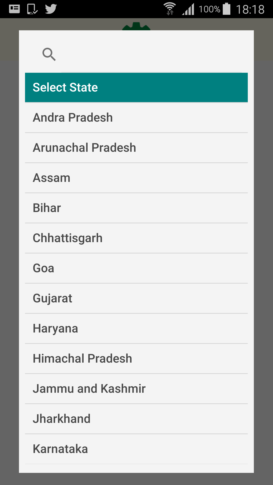
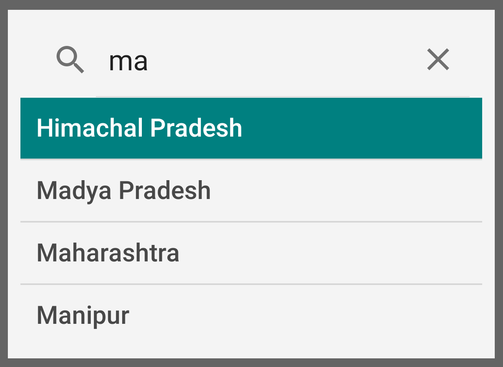
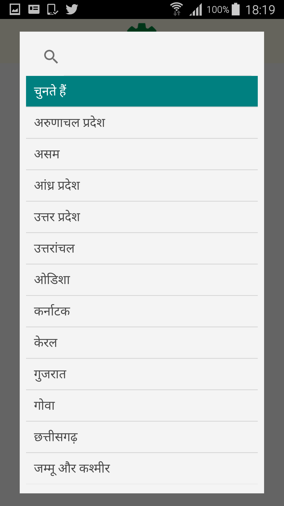

# DevSearchSpinner
DevSearchSpinner is a dialog spinner with the search feature in multiple Indian regional languages<br>
Supports data from custom models.<br>
Sort Data according to type of data set in adapter.<br>

Android Versions Support- <b>2.3-9.0</b><br><br>

# Usage
Add it in your root build.gradle at the end of repositories:

	allprojects {
		repositories {
			maven { url 'https://jitpack.io' }
		}
	}
 
Step 2. Add the dependency

	dependencies {
	        compile 'com.github.DevAbhay23:DevSearchSpinner:v1.0'
	}
<b>In Layout xml :</b>
``` xml
 <devspinner.DevSpinnerControl
        android:id="@+id/spinnerState"
        android:layout_width="wrap_content"
        android:layout_height="wrap_content"
        android:background="@drawable/spinner_custom_background"
           />
```
 <b>In your java file add these lines of code :</b>
  ``` java
  devspinner.DevCustomSpinnerAdap<CustomModel> adapter = new devspinner.DevCustomSpinnerAdap(mContext, R.layout.spinner_view, mList,comparator);
  spinnerState.setAdapter(adapter);
 ```
 <b>For Custom TypeFace:</b>
 ``` java
 adapter.setFontToSpinner(customTypeFace)
```
 For myComparator:
  // Override your compare method on basis of the Custom Model chosen for Spinner Data.
  // Default is String Type Comparison.
``` java
  devspinner.UtilsMethods.MyComparator comparator=new devspinner.UtilsMethods.MyComparator(){
     @Override
     public int compare(Object o1, Object o2) {
         CustomModel w_o1=(CustomModel)o1;
         CustomModel w_o2=(CustomModel)o2;
         return  w_o1.tag.compareTo(w_o2.tag);
     }
  };
```





